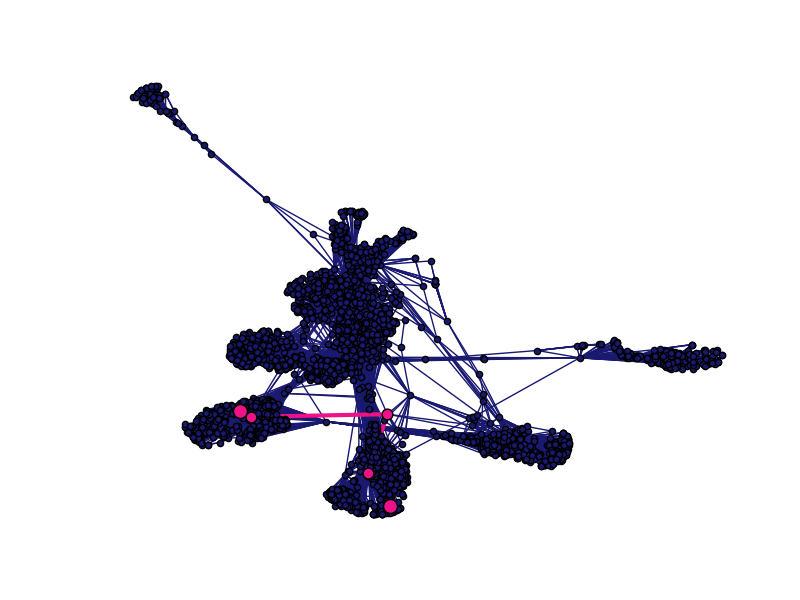

## Social Network Graph with Networkx
Use networkx to explore and plot a graph of anonymized facebook data

* Load data provided by Stanford: https://snap.stanford.edu/data/egonets-Facebook.html

* Explore the data to discover number of nodes, edges, and connected components

* Identify the users that are most important in terms of degree centrality and eigenvector centrality

* Plot the shortest path between any two nodes
